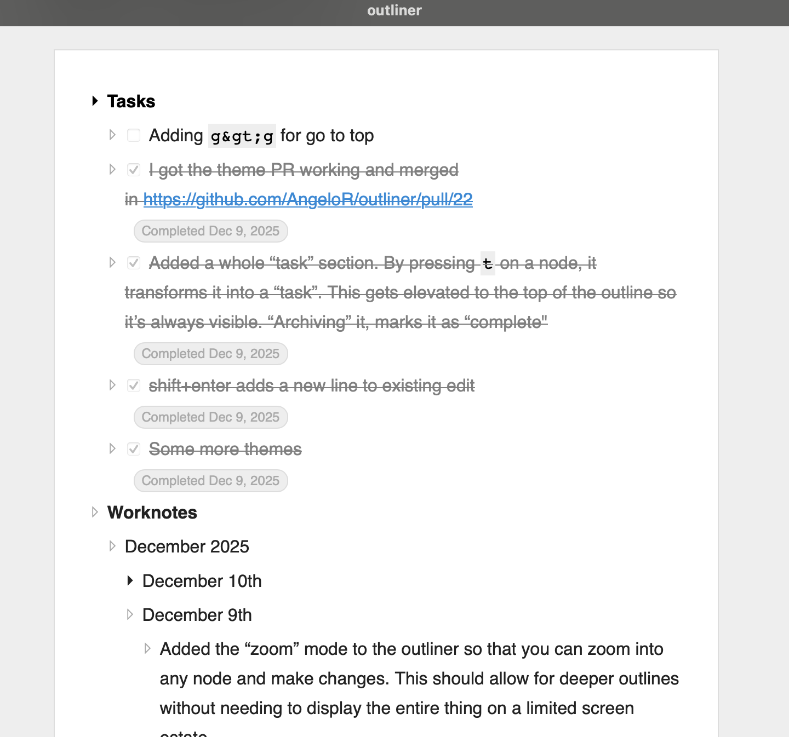
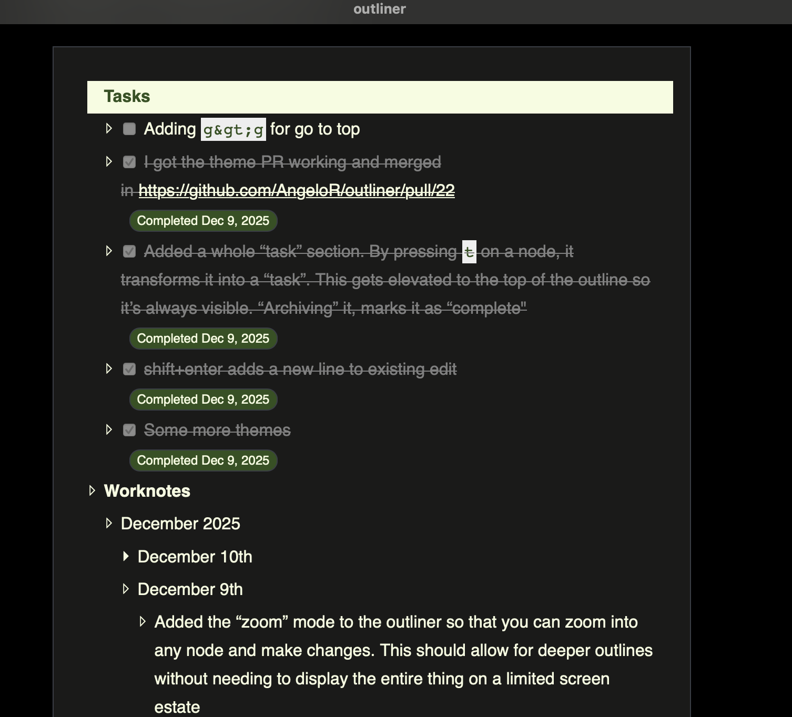
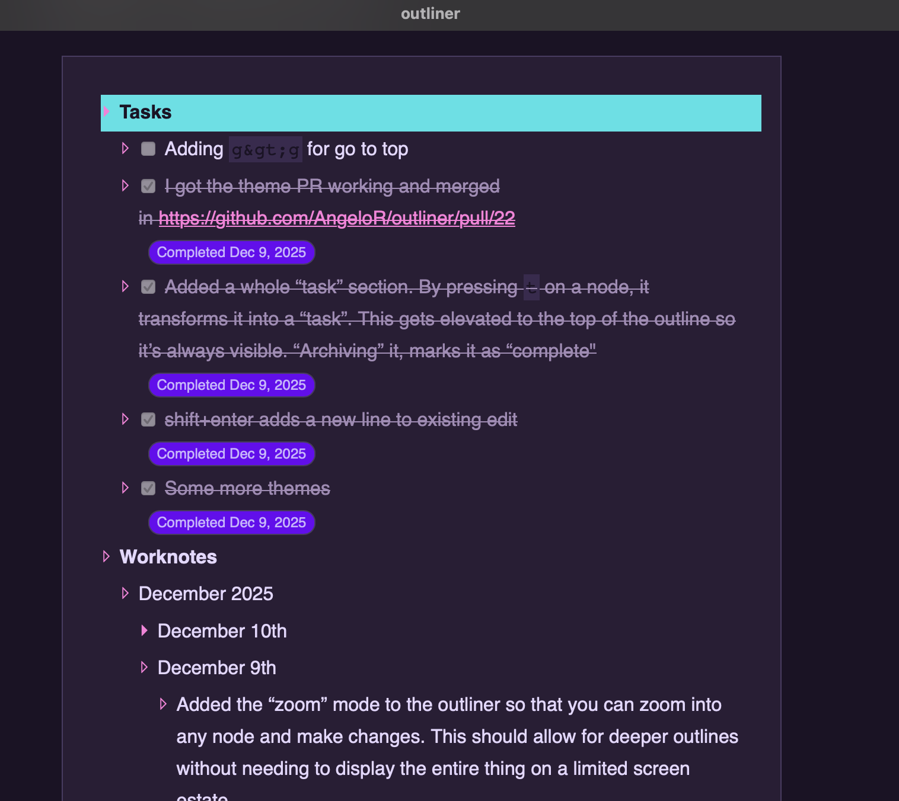

## Outliner


A fast, keyboard‑first outliner for capturing, organizing, and zooming through ideas. Runs as a desktop app via Tauri, and can be served in the browser for quick local testing.

### What is an outliner?

An outliner lets you write in a structured tree of bullets, expanding/collapsing detail to think at the right level. It’s great for notes, plans, drafts, and managing complex projects.

If you’re new to the concept, these are good starting points:

- [Dave Winer's Outliners](http://outliners.com/default.html)
- [Wikipedia: Outliner](https://en.wikipedia.org/wiki/Outliner)

### Highlights

- **Instant navigation**: zoom in/out, expand/collapse, jump around with the keyboard
- **Clean, themeable UI**: built-in light, dark, and synthwave‑84 themes
- **Local-first**: JSON-based storage designed for speed and simplicity
- **Cross-platform foundation**: Tauri + TypeScript

### Install

Choose one of the following:

- **Option A — Prebuilt app (recommended)**  
  Prebuilt binaries will be published on the project’s Releases page.  
  Link: `https://github.com/AngeloR/outliner/releases`

- **Option B — Build from source**  
  See Prerequisites, then:

```bash
git clone https://github.com/AngeloR/outliner
cd outliner
npm install
npm run tauri build
```

### Prerequisites (for building locally)

- **Node.js and npm**: Tested with Node 24.5.0 and npm 11.5.1 (Volta configured)
- **Rust toolchain**: Stable Rust + Cargo (required by Tauri)
- **Platform deps**:
  - macOS: Xcode Command Line Tools (`xcode-select --install`)
  - Windows/Linux: See Tauri prerequisites
- **Tauri CLI**: Installed automatically via npm scripts; you can also `npm exec tauri -- --help`

Helpful links:

- [Tauri prerequisites](https://tauri.app/start/prerequisites/)
- [Install Rust](https://www.rust-lang.org/tools/install)

### Run and build

- **Desktop (dev):**
  ```bash
  npm run tauri dev
  ```
- **Desktop (release build):**
  ```bash
  npm run build           # bundle frontend
  npm run tauri build     # produce a signed, distributable app in src-tauri/target
  ```
- **Web (serve the static UI for quick testing):**
  ```bash
  npm run build           # bundle frontend to public/assets
  npm run dev             # serve ./public at http://localhost:3000
  ```
  Note: Some desktop-only features (like filesystem access) require the Tauri app.

### Keyboard-first by design

Press the in‑app help (`?`) to see available shortcuts, or explore the `src/keyboard-shortcuts/` directory. Common actions include creating bullets, indent/outdent, lift/lower, and zoom.

### Screenshots





### Development

Useful commands:

```bash
npm run webpack-local   # development build with watch
npm run build           # production bundle
npm run dev             # serve ./public for quick browser testing
npm run test            # run unit tests (Jest)
```

### Acknowledgements

- Inspired by decades of outlining work, especially by **Dave Winer**. See `outliners.com` and `scripting.com` for history and ideas.
